# [Allegria](https://bas-nab-1.github.io/Allegria)

Developer: Bastien Nabonne ([bas-nab-1](https://www.github.com/bas-nab-1))

This website is designed to promote a pizzeria in Adamstown. With a rapidly growing number of residents in the area, this pizzeria aims at presenting their products and services with the help of a professionaly designed and responsive on all devices website. The goal for the restaurant is to grow their buisness by raising the number of customers visiting the venue, or placing orders in general.

Wether or not potential customers are aware of this pizzeria, the website will give them informations about the menu, how to make a reservation, how to place an order, how to contact the restaurant and the opening times.

As an Adamstown resident myself, I think the area could do with a few more dining options, and if I could choose the first one I would want opened, it would have to be a pizzeria. So I decided to present this imaginary pizzeria since it is a place I would very much hope would exist.

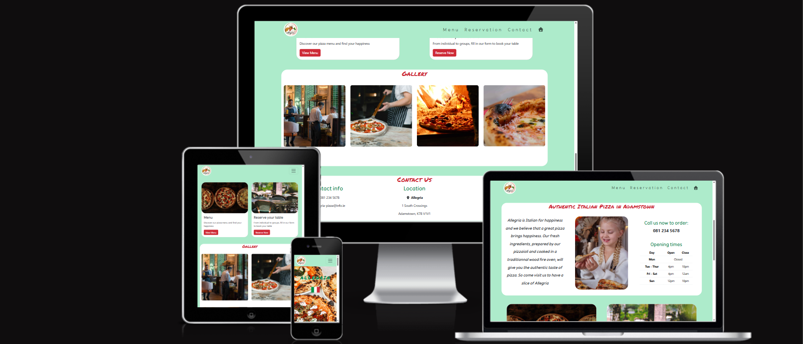

source: [Allegria amiresponsive](https://ui.dev/amiresponsive?url=https://bas-nab-1.github.io/Allegria)

## UX

### The 5 Planes of UX

#### 1. Strategy

**Purpose**
- Promote the products and the services of the pizzeria.
- Provide a seamless user experience to keep users informed and engaged.

**Primary User Needs**
- Learn about the menu
- Learn about reserving a table.
- Learn the contact details and opening times.
- Access responsive, user-friendly content.

**Business Goals**
- Increase revenue.
- Increase awareness of the venue.

#### 2. Scope

**[Features](#features)** (see below)

**Content Requirements**
- Photos showcasing the products.
- Access to the menu.
- Forms for reserving a table.
- Contact details and opening times

#### 3. Structure

**Information Architecture**
- **Navigation Menu**:
  - Accessible links in the navbar.
- **Hierarchy**:
  - Clear call-to-action for ordering and reserving a table.
  - Prominent placement of social media links in the footer.

**User Flow**
1. User lands on the home page → learns about the restaurant and their offerings.
2. Navigates to the menu → discovers the options.
3. Navigates to the reservation form → can book a table.
4. Browses the gallery → has a visual description of the products.
5. .

#### 4. Skeleton

**[Wireframes](#wireframes)** (see below)

#### 5. Surface

**Visual Design Elements**
- **[Colours](#colour-scheme)** (see below)
- **[Typography](#typography)** (see below)

### Colour Scheme

I did not use a tool to establish the color project of this website. I instead based it on the colours of the italian flag and just added a lighter shade of green for the background as to have a good contrast and to not be distracting from the rest of the content.

- primary-color-dark: rgb(2, 122, 60);
- primary-color-light: rgb(173, 235, 203);
- secondary-color: rgb(206,43,55);

### Typography

- [Permanent Marker](https://fonts.google.com/specimen/Permanent+Marker?preview.script=Latn) was used for the primary headers and titles.
- [Cause](https://fonts.google.com/specimen/Cause?preview.script=Latn) was used for all other secondary text.
- [Font Awesome](https://fontawesome.com) icons were used throughout the site, such as the social media icons in the footer.

## Wireframes

To follow best practice, wireframes were developed for mobile, tablet, and desktop sizes.
I've used [figma](https://www.figma.com/)) to design my site wireframes.

| Page | Mobile | Tablet | Desktop |
| --- | --- | --- | --- |
| Home | 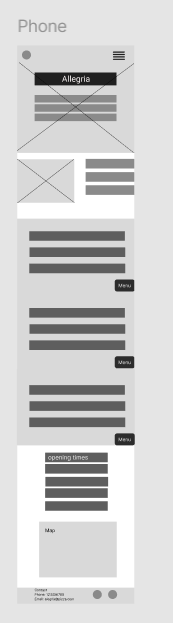 | 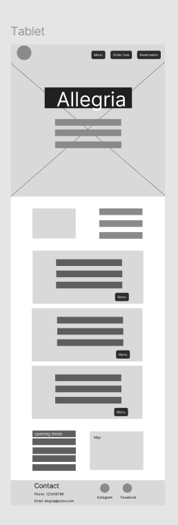 | 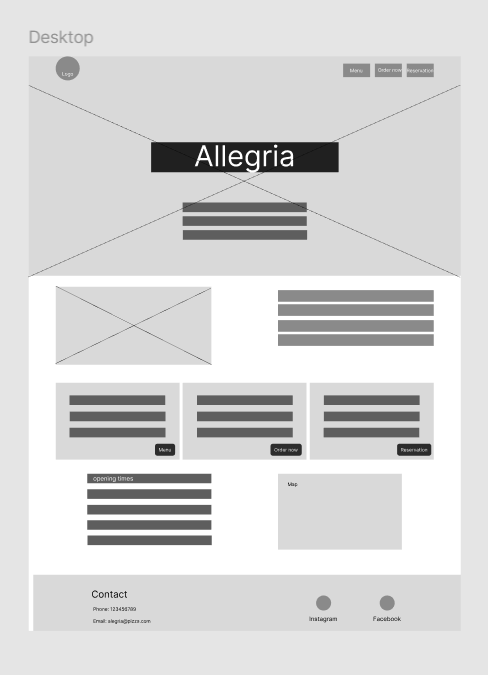 |
| Menu | 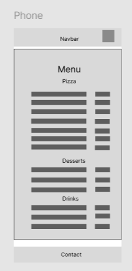 | 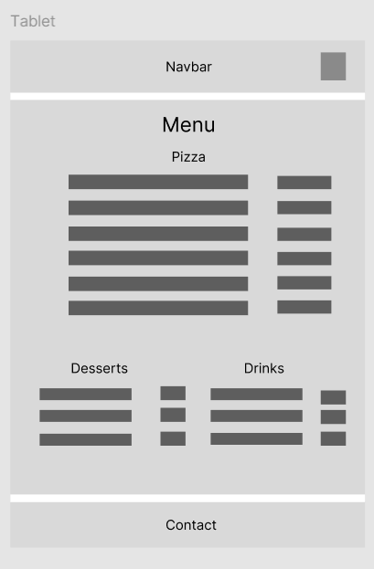 | 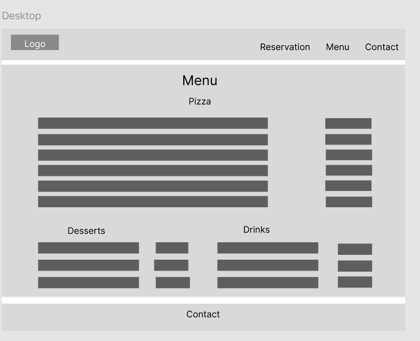 |
| Reservation | 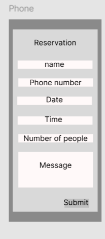 | 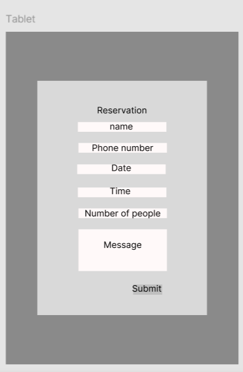 | 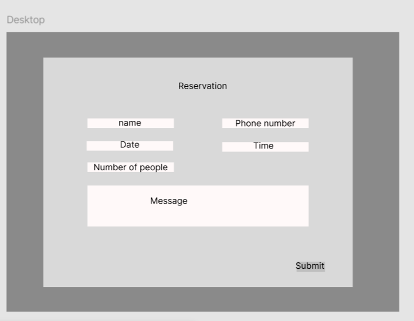 |
| Success | 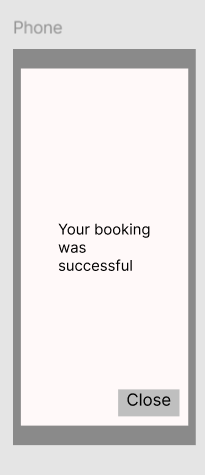 | 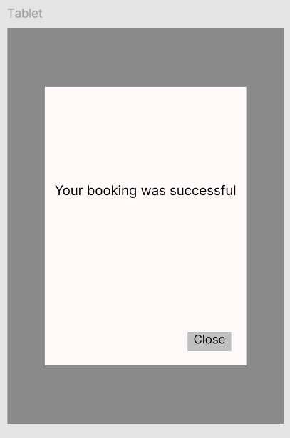 | 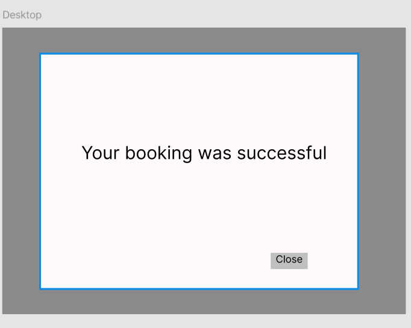 |

## User Stories

| Target | Expectation | Outcome |
| --- | --- | --- |
| As a first time visitor | I need easy navigation and a user-friendly design, including a responsive layout for my device | so I can find information quickly and efficiently without frustration. |
| As a potential customer |I want to see high-quality images and visual descriptions of the food on offer | so I can decide if it's a restaurant i would like to try. |
| As a Prospective Customer | I need to find essential information such as location, contact details, and opening hours clearly and concisely | so I can easily plan my visit. |
| As an user | I want to book a table using a simple booking inquiry form | so I can easily organise a group visit or a special occasion. |
| As a pizza lover |  I would like to know the menu options | so I can decide if I would visit your restaurant. |
| As a user | I would like to follow the restaurant on various platforms (e.g., Instagram, Facebook, Twitter) | so that I can stay updated with new products and promotions. |
| As a user | I would like to see a 404 error page if I get lost | so that it's obvious that I've stumbled upon a page that doesn't exist. |

## Features

### Existing Features

| Feature | Notes | Screenshot |
| --- | --- | --- |
| Navbar | Featured on all pages, the full responsive navigation bar includes links to the Logo, Home page, Menu page, Reservation page and Contact section. It is identical in each page to allow for easy navigation. On the smallest screens, a burger icon is used to toggle the navbar so it doesn't take up too much space. This section will allow the user to easily navigate from page to page across all devices without having to revert back to the previous page via the "back" button. The navbar is also `fixed`, so it stays in view even if the user has scrolled to the bottom of the page. |  |
| Hero Image | This section includes a background image of a pizza that occupies the full screen with a text-overlay indicating the name of the venue.  | 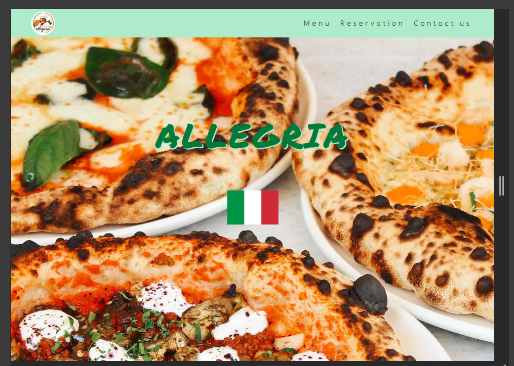 |
| Introduction | This section introduces the restaurant concept with a short text alongside the image of a young girl eating a pizza, and next to it, the user will find the phone number to place an order along with the opening times. | 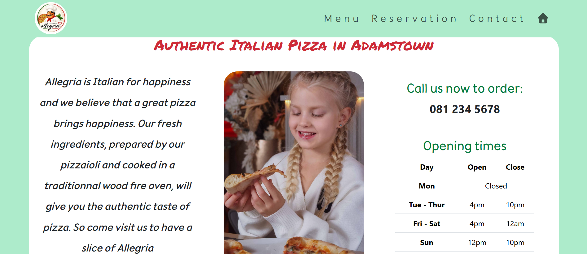 |
| Services | This section is composed of two cards from bootstrap, each of them has a link redirecting the user a seperate page, the menu page and the reservation page respectively. They include a text presenting the service. Visually, the cards are not on a white background like the other sections but instead they are displayed on the website's background in order to provide a visual seperation for the user.  | 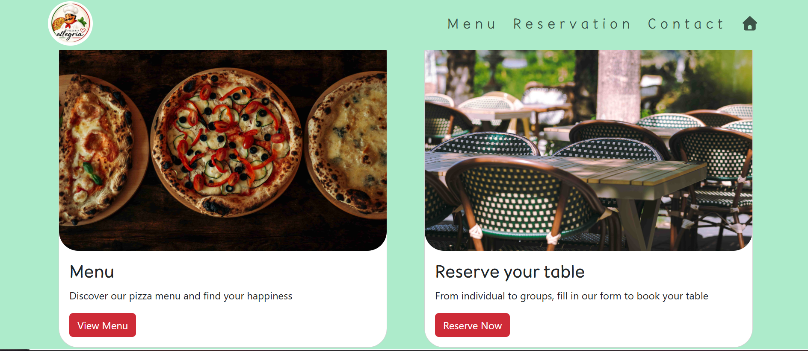 |
| Gallery | The gallery will provide the user with supporting images to see what the products look like. This section is valuable to the user, as they will be able to visualize the food served. On mobile devices, the images are displayed in a bootstrap carousel where the user can slide from one to the next. For larger devices, 768px and up the images are all displayed at once, 2 side by side on tablet and all images side by side on desktops |  |
| Footer | The footer includes links to the relevant social media sites for *Love Running*. The links will open in a new tab to allow easy navigation for the user. The footer is valuable to the user, as it encourages them to keep connected via social media. |  |
| Menu | This page allows the user to see the list of items sold at the restaurant. It is seperated in three sections, the first one is for the choice of pizza along with the details of the ingredients, the second section for desserts and the third one displays the drinks. Each product has a their prices written next to it. This will allow the user to have an idea of the type of food and drinks served at the restaurant before calling or visiting the restaurant first. |  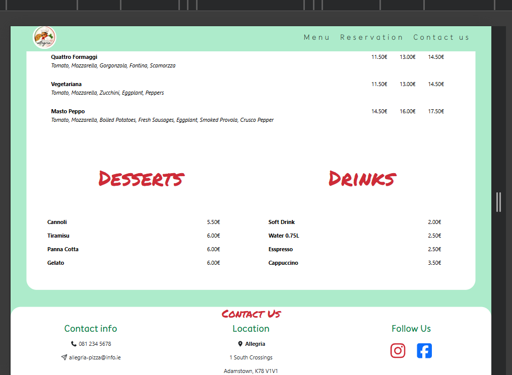 |
| Reservation | The reservation page provides form the user is invited to fill in to make a booking at the venue. It is a form comprised of required inputs for name, phone number, date of the booking, time of the booking, the number of people and has an optional textarea to write a message. At the bottom of the page is a submit button that redirects the user to the confirmation page | 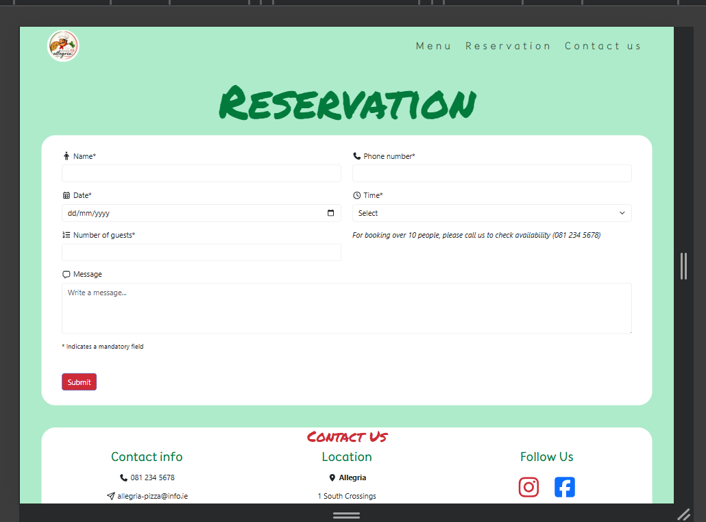 |
| Confirmation | The confirmation page will give the illusion that the reservation form was submitted successfully to the restaurant. Due to the lack of a database or email system so far, this is a fake confirmation page. This page features a link to return to the home page | 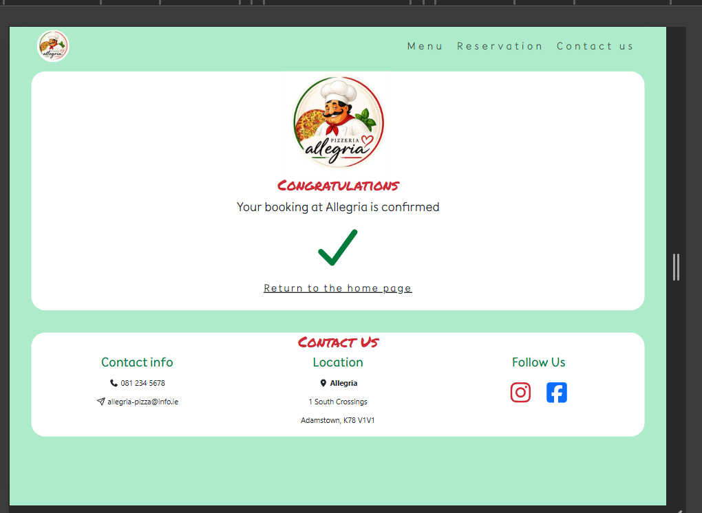 |
| 404 | The 404 error page will indicate when a user has somehow navigated to a page that doesn't exist. This replaces the default GitHub Pages 404 page, and ties-in with the look and feel of the *Allegria* site by using the standard navbar and footer. | 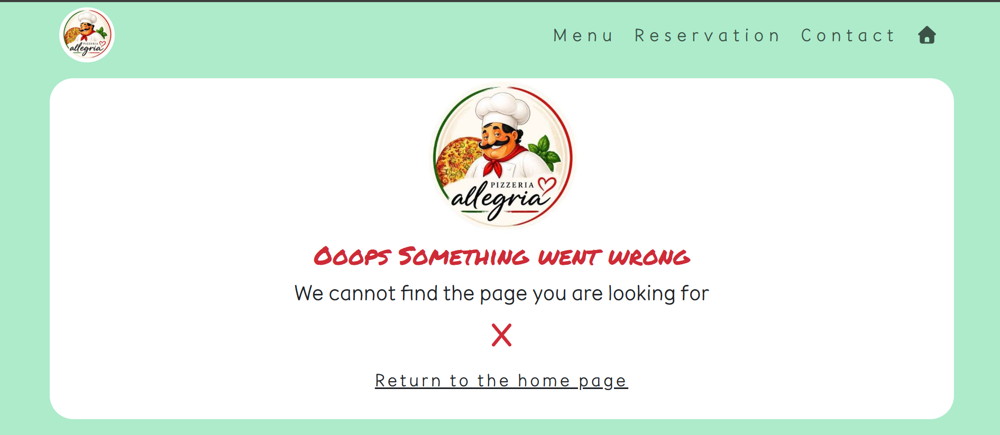 |

### Future Features

- **Order online feature**: Allow users to place their orders directly on the website.
- **Order delivery**: Allow users to have their orders directly brought to their home.
- **Newsletter**: The option for the user to receive updates on the menu and special promotions.

## Tools & Technologies

| Tool / Tech | Use |
| --- | --- |
|  | Generate README and TESTING templates. |
|  | Version control. (`git add`, `git commit`, `git push`) |
|  | Secure online code storage. |
|  | Local IDE for development. |
|  | Main site content and layout. |
|  | Design and layout. |
|  | Hosting the deployed front-end site. |
|  | Front-end CSS framework for modern responsiveness and pre-built components. |
|  | Creating wireframes. |
|  | Icons. |
|  | Tutorials/Reference Guide |
|  | Generating the favicon. |

## Agile Development Process

### GitHub Projects

[GitHub Projects](https://www.github.com/bas-nab-1/Allegria/projects) was used to track progress on the project by adding the user stories, and completing their respective tasks and acceptance criteria. 

| User Story | Screenshot |
| --- | --- | 
| User story 1 | 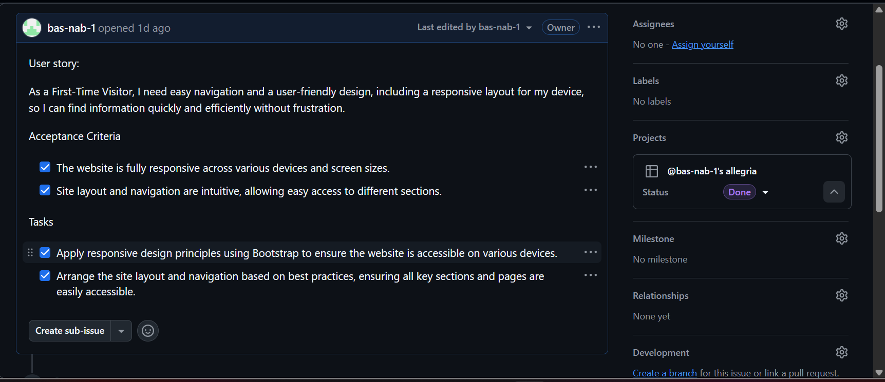 |
| User story 2 | 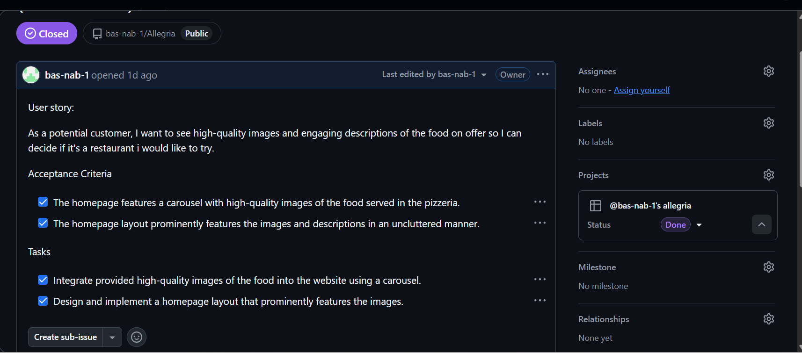 |
| User story 3 | 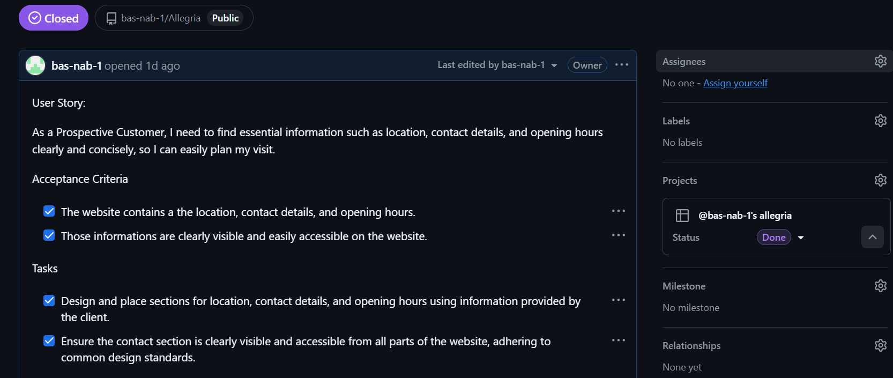 |
| User story 4 | 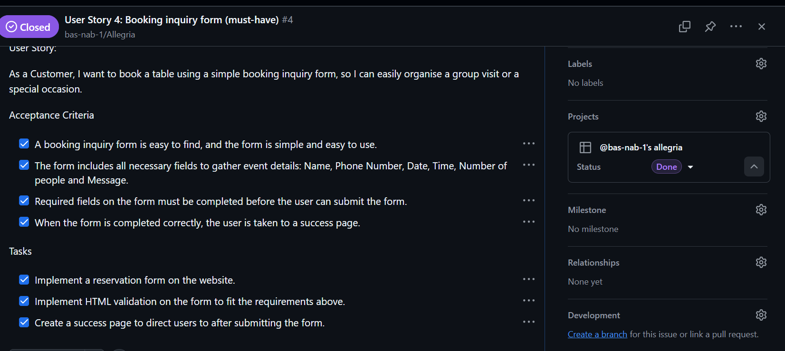 |
| User story 5 | 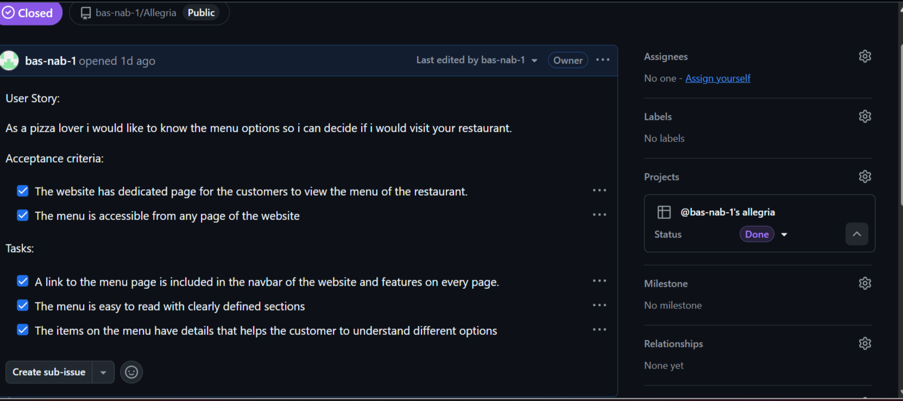 |
| User story 6 | 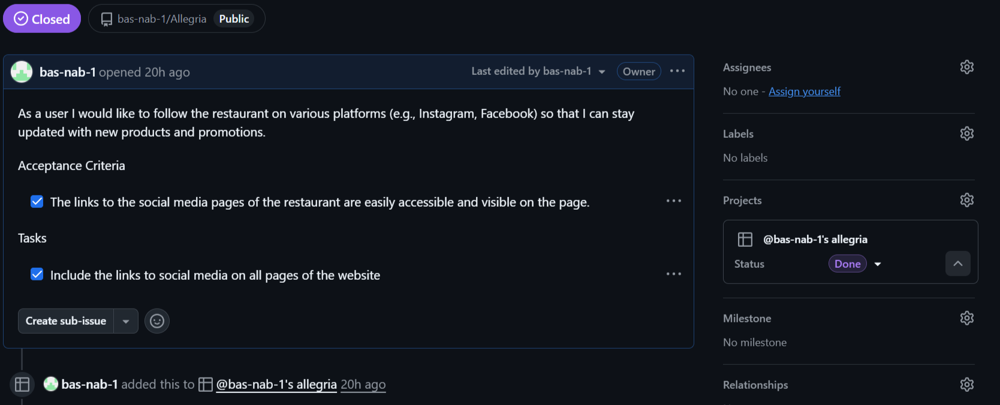 |
| User story 7 | 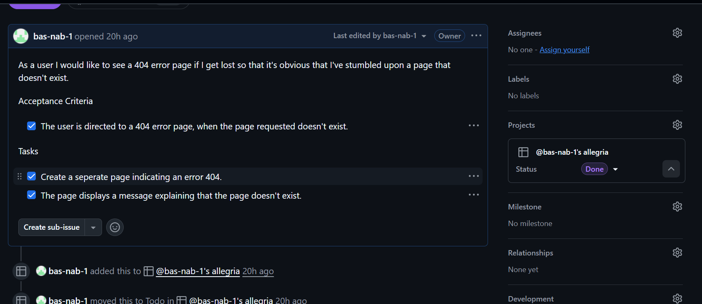 |

## Testing

> [!NOTE]  
> For all testing, please refer to the [TESTING.md](TESTING.md) file.

## Deployment

### GitHub Pages

The site was deployed to GitHub Pages. The steps to deploy are as follows:

- In the [GitHub repository](https://www.github.com/bas-nab-1/Allegria), navigate to the "Settings" tab.
- In Settings, click on the "Pages" link from the menu on the left.
- From the "Build and deployment" section, click the drop-down called "Branch", and select the **main** branch, then click "Save".
- The page will be automatically refreshed with a detailed message display to indicate the successful deployment.
- Allow up to 5 minutes for the site to fully deploy.

The live link can be found on [GitHub Pages](https://bas-nab-1.github.io/Allegria).

### Local Development

This project can be cloned or forked in order to make a local copy on your own system.

#### Cloning

You can clone the repository by following these steps:

1. Go to the [GitHub repository](https://www.github.com/bas-nab-1/Allegria).
2. Locate and click on the green "Code" button at the very top, above the commits and files.
3. Select whether you prefer to clone using "HTTPS", "SSH", or "GitHub CLI", and click the "copy" button to copy the URL to your clipboard.
4. Open "Git Bash" or "Terminal".
5. Change the current working directory to the location where you want the cloned directory.
6. In your IDE Terminal, type the following command to clone the repository:
	- `git clone https://www.github.com/bas-nab-1/Allegria.git`
7. Press "Enter" to create your local clone.

Alternatively, if using Ona (formerly Gitpod), you can click below to create your own workspace using this repository.

**Please Note**: in order to directly open the project in Ona (Gitpod), you should have the browser extension installed. A tutorial on how to do that can be found [here](https://www.gitpod.io/docs/configure/user-settings/browser-extension).

#### Forking

By forking the GitHub Repository, you make a copy of the original repository on our GitHub account to view and/or make changes without affecting the original owner's repository. You can fork this repository by using the following steps:

1. Log in to GitHub and locate the [GitHub Repository](https://www.github.com/bas-nab-1/Allegria).
2. At the top of the Repository, just below the "Settings" button on the menu, locate and click the "Fork" Button.
3. Once clicked, you should now have a copy of the original repository in your own GitHub account!

### Local VS Deployment

There are no remaining major differences between the local version when compared to the deployed version online.

## Credits

### Content

| Source | Notes |
| --- | --- |
| [Markdown Builder](https://markdown.2bn.dev) | Help generating Markdown files |
| [Chris Beams](https://chris.beams.io/posts/git-commit) | "How to Write a Git Commit Message" |
| [Bootstrap](https://getbootstrap.com) | Various components / responsive front-end framework |
| Code Institute | Providing the JS Script to close the toggle navbar when navigating to an in page link |
| Tim Nelson | Providing me with the JS Script for the reservation form and help writting the documentation |

### Media

| Source | Notes |
| --- | --- |
| [favicon.io](https://favicon.io) | Generating the favicon |
| [Font Awesome](https://fontawesome.com) | Icons used throughout the site |
| [Pexels](https://www.pexels.com/photo/delicious-assorted-pizzas-on-marble-table-32605626/) | Hero |
| [Pexels](https://www.pexels.com/photo/variety-of-gourmet-wood-fired-pizzas-on-rustic-table-33593005/) | Menu Card Image |
| [Pexels](https://www.pexels.com/photo/outdoor-cafe-tables-amidst-greenery-34862049/) | Reservation Card Image |
| [Pexels](https://www.pexels.com/photo/a-pizza-with-cheese-and-basil-on-it-27647972/) | Gallery Image |
| [Pexels](https://www.pexels.com/photo/close-up-photo-of-pizza-near-bonfire-1082343/) | Gallery Image |
| [Pexels](https://www.pexels.com/photo/cook-preparing-pizza-5953500/) | Gallery Image |
| [Pexels](https://www.pexels.com/photo/customer-ordering-meal-at-table-in-restaurant-18338617/) | Gallery Image |
| [Pexels](https://www.pexels.com/photo/a-girl-eating-pizza-15611219/) | Intro Image |
| [Pizzeria Allegria Jijila](https://www.facebook.com/profile.php?id=61569082042641) | Logo | 
| [Squooshapp](https://squoosh.app/) | Compressing images |

### Acknowledgements

- I would like to thank my Code Institute mentor, [Tim Nelson](https://www.github.com/TravelTimN) for the support throughout the development of this project.
- I would like to thank the [Code Institute Discord community](https://discord-portal.codeinstitute.net) for the moral support.
- I would like to thank my partner, for believing in me, and allowing me to make this transition into software development.
- I would like to thank my employer, for supporting me in my career development change towards becoming a software developer by allowing me to work a reduced number of hours.

